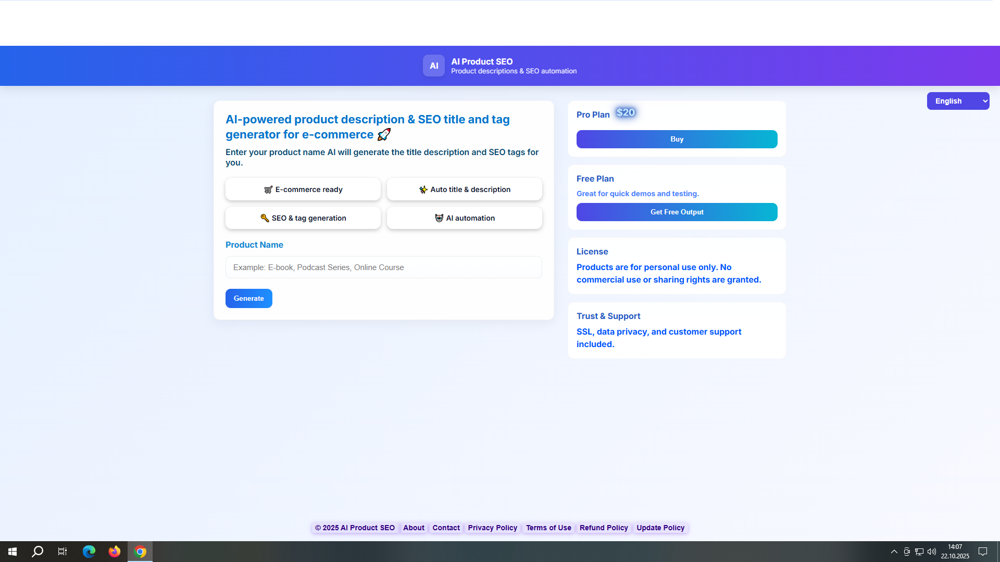
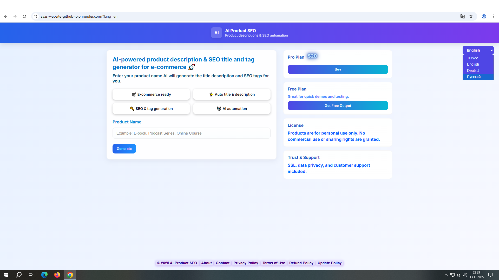
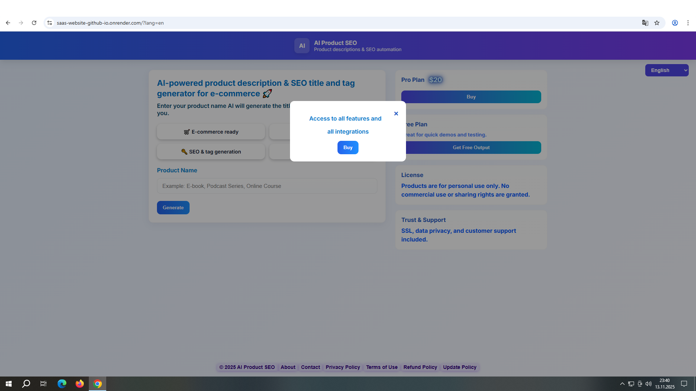
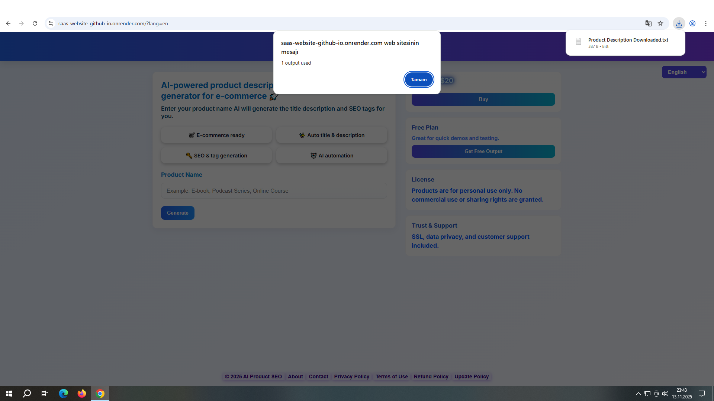
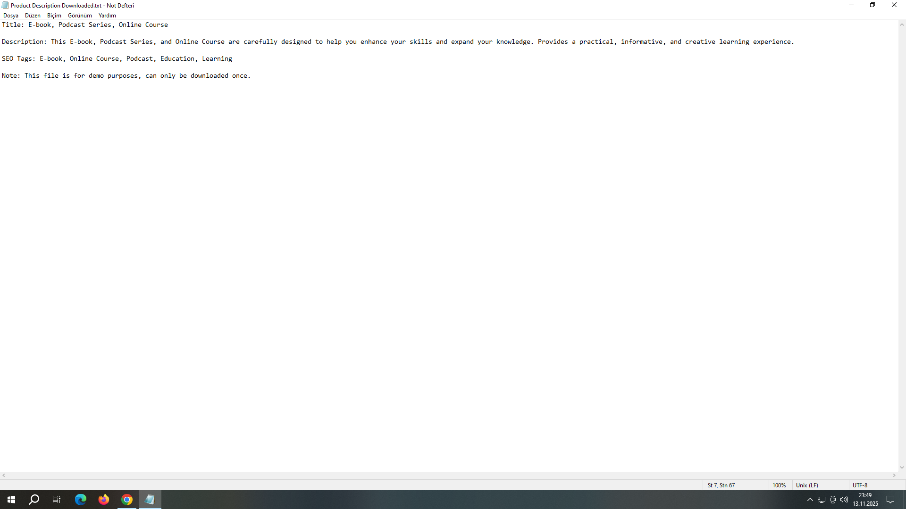

# MySaaSPlatform

AI SaaS web application for the digital products industry, generating product titles, descriptions, and SEO tags with Python backend and AI integration.

## Contents
- index.html → Main page
- style.css → Stylesheet
- script.js → JavaScript functions
- backend.py → Python backend

  

## Dashboard

  

## Language Select

At the top right of the screen you have the language select and you can choose whichever language you want specifically.

  

## Buy Button

After clicking the Buy button the customer is redirected to an official online banking or payment panel provided by a Merchant of Record where the payment is processed on behalf of the SaaS site owner and the panel displays the owner's banking information.

  

## Get Free Output Button

By clicking the Get Free Output button you can download a .txt file to your computer in four different languages each time containing the same title, description, and SEO tags. This system serves as a demo for you and also helps you gain an understanding of how it works.

  

## Product Description Downloaded

After downloading the free output as a .txt file to your computer you can view its contents in the four available languages along with example descriptions. This serves as a preview of how the paid version works. 

  

## Generate Order

After completing the payment through the Buy button for your real digital product you enter the product's name under "Product Name"—for example, "Podcast Series". By clicking the Generate button you can then receive the actual AI-generated content of your digital product. The content appears just below the Generate button and in the center of the Copy All button.

